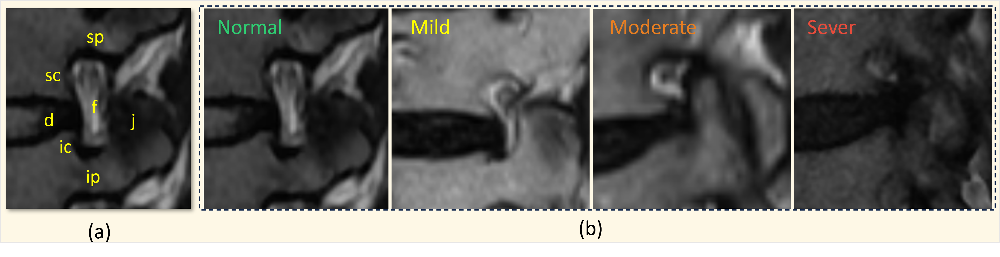
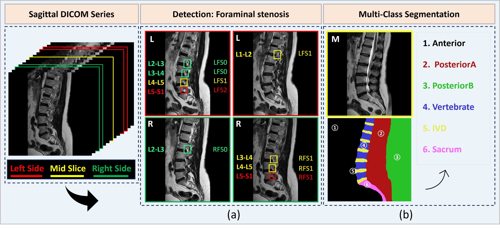
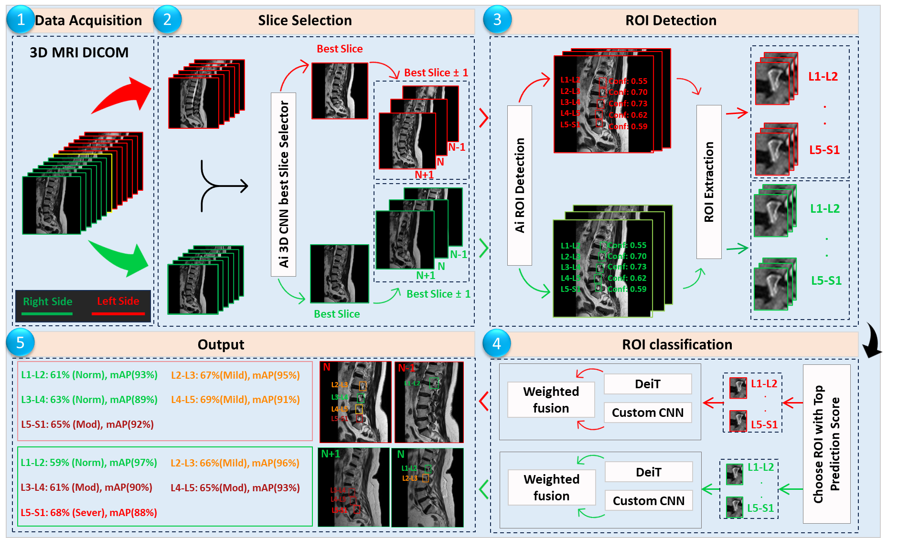
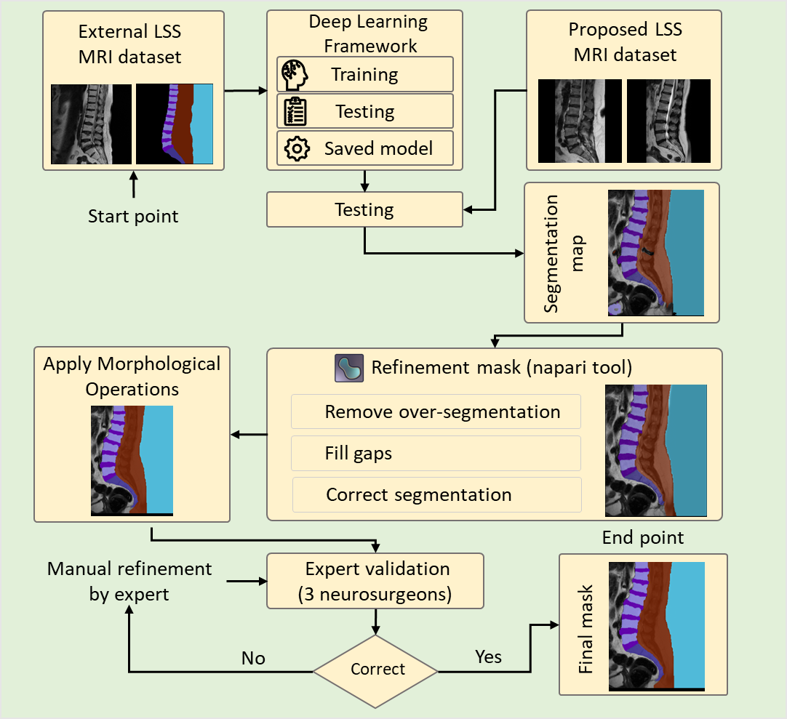

# LSS-MRI-AISSLab Dataset

**LSS-MRI-AISSLab Dataset** is a large-scale, IRB-approved sagittal lumbar spine MRI dataset designed for lumbar foraminal stenosis detection, severity grading, and anatomical segmentation.

The dataset is specifically developed to support explainable and clinically meaningful AI research by combining pixel-level anatomical segmentation with multi-level, bilateral foraminal stenosis detection and grading across the lumbar spine.

**Dataset DOI (Mendeley Data):**  
https://data.mendeley.com/datasets/rgb77xm3jf/4

---

## Foraminal Anatomy and Severity Grading Standard



Lumbar neural foramen anatomy and foraminal stenosis grading on sagittal T2-weighted MRI.  
Anatomical landmarks include the superior and inferior pedicles, vertebral bodies, intervertebral disc, facet joint, and neural foramen.  
Severity grades are defined as **Normal**, **Mild**, **Moderate**, and **Severe** based on perineural fat compression.

---

## Dataset Overview



Overview of sagittal lumbar spine DICOM volumes showing left, middle, and right sagittal slices.  
The dataset includes bounding-box annotations for bilateral foraminal stenosis across lumbar levels **L1–L2 to L5–S1**, as well as pixel-level multi-class anatomical segmentation masks.

---

## 📦 Dataset Summary

- **Patients:** 500  
- **Modality:** Sagittal T2-weighted lumbar spine MRI  
- **Total slices:** ~8,500  
- **Annotations:**
  - 2,979 foraminal stenosis bounding boxes  
  - Left / Right laterality labels  
  - 4-class severity grading (Normal, Mild, Moderate, Severe)  
  - Pixel-level anatomical segmentation masks  

---
## 🧠 CAD Pipeline Overview



**Figure:** Overview of the proposed end-to-end CAD pipeline for lumbar spine MRI analysis. The framework consists of five main stages:  
(1) Data acquisition from sagittal MRI DICOM volumes,  
(2) Best slice selection using a 3D CNN-based selector,  
(3) AI-based ROI detection and extraction,  
(4) ROI classification using hybrid models (DeiT + CNN) with weighted fusion, and  
(5) Final prediction output across lumbar levels (L1–L2 to L5–S1).


## 📊 Dataset Distribution by Level

This table shows the distribution of foraminal stenosis across lumbar levels (L1–L2 to L5–S1), including side involvement and severity grades. The dataset is dominated by early-stage cases, with Normal (67.45%) and Mild (17.06%) being most frequent.

| Level | Left Side | Right Side | Both Side | Total | Normal (%) | Mild (%) | Moderate (%) | Severe (%) |
|------|----------:|-----------:|----------:|------:|------------|----------|---------------|-------------|
| L1-L2 | 313 | 258 | 193 | 571 | 538 (94.22) | 28 (4.90) | 5 (0.88) | 0 (0.00) |
| L2-L3 | 363 | 323 | 251 | 686 | 573 (83.53) | 77 (11.23) | 22 (3.21) | 14 (2.04) |
| L3-L4 | 421 | 374 | 288 | 795 | 475 (59.75) | 163 (20.50) | 95 (11.95) | 62 (7.80) |
| L4-L5 | 334 | 315 | 207 | 649 | 253 (38.98) | 172 (26.50) | 113 (17.41) | 111 (17.10) |
| L5-S1 | 152 | 126 | 64 | 278 | 170 (61.15) | 68 (24.46) | 19 (6.83) | 21 (7.56) |

---

## Dataset Components

### 1. Sagittal Foraminal Detection and Severity Classification

- Bounding-box annotations on sagittal MRI slices  
- Lumbar levels: **L1–L2 to L5–S1**  
- Laterality: **Left (LFS)** and **Right (RFS)**  
- Severity encoding:
  - `0` → Normal  
  - `1` → Mild  
  - `2` → Moderate  
  - `3` → Severe  
- Annotation format: **PASCAL VOC (XML)**  

---

### 2. Anatomical Segmentation Masks

Pixel-level segmentation masks are provided for:

- Vertebral bodies  
- Intervertebral discs (IVDs)  
- Sacrum  
- Posterior A  
- Posterior B  
- Background / anterior region  

Masks were generated using a **human-in-the-loop AI annotation workflow** and validated by expert neurosurgeons to ensure clinical reliability.


---
## 🧠 Human-in-the-Loop Annotation Pipeline

<p align="center">
  
</p>

<p align="center">
<b>Figure.</b> Human-in-the-loop annotation workflow. Initial segmentation is generated using a deep learning model, followed by refinement through morphological operations and manual corrections using annotation tools. Final masks are validated by expert neurosurgeons to ensure clinical accuracy.
</p>

## Citation

If you use this dataset or the associated code, please cite:

```bibtex
@article{abdulmahmod2026medical,
  title   = {Medical Spine Sagittal MRI Dataset for Segmentation and Foraminal Stenosis Detection},
  author  = {Abdulmahmod, Osamah F. and Al-Antari, Mugahed A. and Kwon, Hyunwook and Habib, Afnan and Raza, Mukhlis and Kaplan, Metin and Ertu{\u{g}}rul, Bilal and Ak{\c{c}}in, {\.I}smail and B{\"u}t{\"u}n, Ertan and Gu, Yeong Hyeon},
  journal = {Scientific Data},
  year    = {2026},
  doi     = {10.1038/s41597-026-07138-x},
  url     = {https://doi.org/10.1038/s41597-026-07138-x},
  publisher = {Nature Publishing Group}
}

@inproceedings{Salem2025AutoSpineAI,
  title     = {AutoSpineAI: Lightweight Multimodal CAD Framework for Lumbar Spine MRI Assessments},
  author    = {Salem, Saied and Habib, Afnan and Raza, Mukhlis and Al-Huda, Zaid and
               Al-maqtari, Omar and Ertu{\u{g}}rul, Bilal and Y{\i}ld{\i}r{\i}m, {\"O}zal and
               Gu, Yeong Hyeon and Al-Antari, Mugahed A.},
  booktitle = {Proceedings of the IEEE-EMBS International Conference on Biomedical and Health Informatics (BHI)},
  year      = {2025},
  organization = {IEEE}
}

@article{AlAntari2025AISystematicReview,
  title   = {Evaluating AI-powered predictive solutions for MRI in lumbar spinal stenosis: a systematic review},
  author  = {Al-Antari, Mugahed A. and Salem, Saied and Raza, Mukhlis and Elbadawy, Ahmed S. and
             B{\"u}t{\"u}n, Ertan and Aydin, Ahmet Arif and Aydo{\u{g}}an, Murat and
             Ertu{\u{g}}rul, Bilal and Talo, Muhammed and Gu, Yeong Hyeon},
  journal = {Artificial Intelligence Review},
  volume  = {58},
  number  = {8},
  pages   = {221},
  year    = {2025},
  publisher = {Springer}
}
